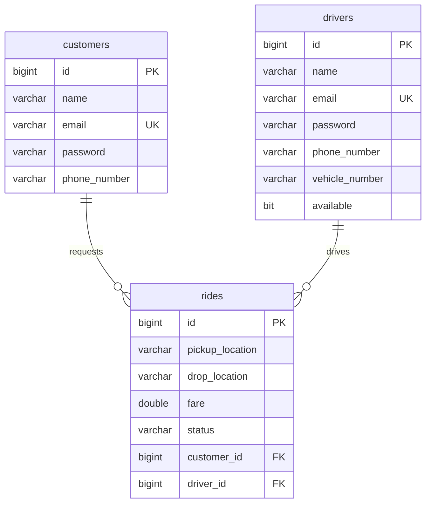
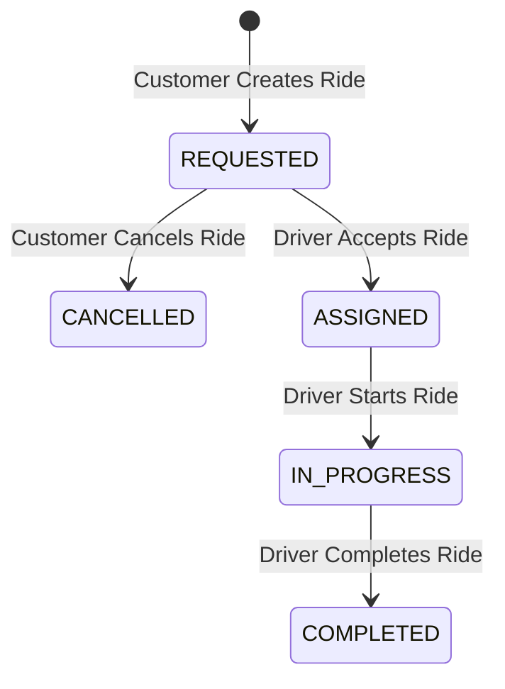

# Ride Booking System Simulator

[](https://www.oracle.com/java/technologies/downloads/)
[](https://spring.io/projects/spring-boot)
[](https://www.mysql.com/)
[](https://spring.io/projects/spring-security)

A high-performance, beginner-friendly Spring Boot backend for a ride-booking platform simulator, featuring JWT stateless security, Spring Data JPA, and MySQL database persistence. 

This project is carefully structured with exactly **19 top-level Java types**, making it clean, easy to navigate, and ideal for explaining architecture and system design patterns in interviews.

---

## 🚀 Key Features

*   **Authentication & Security**: JWT-based stateless security with BCrypt password hashing for both Customers and Drivers.
*   **Ride Lifecycle Management**: Full state transition controls: `REQUESTED` ➔ `ASSIGNED` ➔ `IN_PROGRESS` ➔ `COMPLETED`.
*   **Driver Matching & Dispatch**: Endpoint for drivers to view unassigned requested rides and accept them.
*   **Transactional Integrity**: Service layers wrapped in `@Transactional` to guarantee database consistency during status updates and concurrency controls.
*   **Input Validation & Exception Handling**: API requests are validated (via `jakarta.validation`), and exceptions are mapped cleanly to REST-friendly HTTP statuses.

---

## 🏛️ Layered Architecture & Structure

The system is designed following the **Layered (n-Tier) Architecture** pattern to enforce a clean separation of concerns:

```
                  ┌────────────────────────┐
                  │      REST Clients      │
                  │   (Postman / Mobile)   │
                  └───────────┬────────────┘
                              │ HTTP Requests (JSON)
                              ▼
                  ┌────────────────────────┐
                  │    Controller Layer    │ <--- (AuthController, RideController)
                  └───────────┬────────────┘
                              │ DTOs (AuthRequest, RideCreateRequest)
                              ▼
                  ┌────────────────────────┐
                              │ Domain Entities (Customer, Driver, Ride)
                  │     Service Layer      │ <--- (AuthService, RideService, JwtService)
                  │   [Business Logic]     │
                  └───────────┬────────────┘
                              ▼
                  ┌────────────────────────┐
                  │    Repository Layer    │ <--- (CustomerRepository, etc.)
                  └───────────┬────────────┘
                              │ Spring Data JPA / Hibernate
                              ▼
                  ┌────────────────────────┐
                  │     Database Layer     │ <--- (MySQL)
                  └────────────────────────┘
```

### Components Breakdown:
1.  **Controller Layer**: Exposes REST endpoints, validates request payloads, and handles HTTP response mapping.
2.  **Service Layer**: Encapsulates business logic, orchestrates transactional boundaries, performs permission checks, and handles entity-to-DTO conversions.
3.  **Repository Layer**: Extends `JpaRepository` to interface with MySQL, utilizing Spring Data JPA for CRUD operations and custom query methods.
4.  **Security Layer**: Hooks into the Spring Security filter chain to intercept requests, extract JWT bearer tokens, and set the security context.

---

## 🗄️ Database Design

The relational schema is automatically generated using Hibernate. It consists of three main tables:



*   **Customer & Driver**: Independent user profiles with unique email address requirements.
*   **Ride**: Stores pickup/drop coordinates, fare, and foreign keys referencing the requesting `Customer` and the assigned `Driver`.

---

## 🚥 Ride Lifecycle State Transitions

The core of the simulator is the state machine governing the `Ride` status:



*   **Concurrency Constraint**: When a driver accepts a ride, their availability is set to `false`. They cannot accept another ride until the current ride is marked `COMPLETED` (where availability returns to `true`).
*   **Security Guardrails**: 
    *   Only the customer who requested a ride can fetch its details or cancel it.
    *   Only the driver assigned to a ride can start or complete it.

---

## 🛠️ Getting Started

### 1. Prerequisites
Ensure you have the following installed:
*   Java Development Kit (JDK) 21
*   Maven 3.x
*   MySQL Server 8.x

### 2. Configure Configuration & Secrets
Create a database named `ride_booking_db` in MySQL.

By default, the application uses fallback configurations defined in [application.properties](src/main/resources/application.properties) suitable for local development with database user `root` and password `root`.

To configure credentials securely (especially for production), copy [.env.example](.env.example) to a `.env` file or export the following environment variables on your system:
*   `DB_URL`: MySQL connection URL.
*   `DB_USERNAME`: Database username.
*   `DB_PASSWORD`: Database password.
*   `JWT_SECRET`: Base64-encoded JWT signing secret.

### 3. Run the App
Navigate to the root directory and run:
```bash
mvn spring-boot:run
```
The server will boot up and start listening for HTTP requests on `http://localhost:8080`.

---

## 🧪 Verification & Postman Testing

We have included a full, step-by-step Postman collection guide in the project. Please refer to [postman_rest_apis.md](postman_rest_apis.md) to learn how to test:
1.  **Registration & Token Generation**
2.  **Creating and Cancelling Rides**
3.  **Driver Acceptance and Transit Lifecycle**
4.  **Database state validations**
