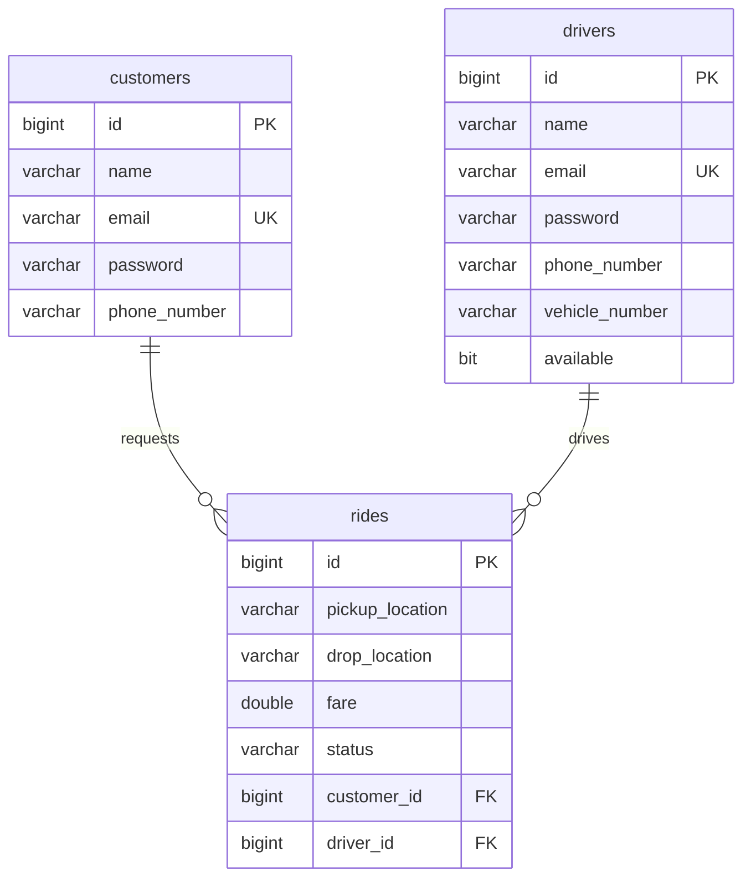

# Ride Booking System Explanation & Interview Guide

This document provides an in-depth explanation of the Ride Booking System Simulator's architecture, design patterns, security model, database schema, and API workflow. It is structured to serve as both comprehensive developer documentation and a preparation guide for technical interviews.

---

## 📂 Project Folder Structure

The project follows a standard n-tier Spring Boot package layout to isolate responsibilities:

*   **`controller`**: Exposes REST endpoints, validates request structures, and manages HTTP mapping.
*   **`service`**: Implements core business logic, handles password verification, generates JWT tokens, and manages transaction boundaries.
*   **`repository`**: Inherits `JpaRepository` to interface with the database.
*   **`entity`**: Contains database-mapped domain models and enums representing business state.
*   **`dto`**: Holds Java records used for request/response serialization (data transfer objects).
*   **`security`**: Manages filter chains, intercepts token headers, and manages Spring Security details.
*   **`exception`**: Maps validation errors and operational failures to client-friendly HTTP statuses.

---

## 🗺️ Entity Relationship Diagram

The relational mapping is designed as follows (defined dynamically via Spring Data JPA annotations):



### Relational Guidelines
*   **One-to-Many (`customers` ➔ `rides`)**: A single customer can request multiple rides over time, but each ride belongs to exactly one customer.
*   **One-to-Many (`drivers` ➔ `rides`)**: A driver can complete multiple rides, but a ride is assigned to at most one driver.
*   **Nullability**: The `driver_id` field in the `rides` table is nullable initially. It is set when a driver accepts the ride request.

---

## 🔒 Security Architecture (BCrypt & JWT)

### Hashing vs. Encryption
*   **Hashing (BCrypt)**: A one-way function. It is mathematically impossible to decrypt a BCrypt hash back into the original plain text password. The server verifies a password by hashing the input password and comparing the resulting hash to the one stored in the database.
*   **Encryption**: A two-way function. Data is scrambled using an encryption key and can be decrypted back to its raw form using a decryption key. Encryption is used for sensitive data that must be read again (e.g. credit card details).

### Why BCrypt?
BCrypt is slow by design (incorporates a configurable cost factor) and automatically applies a unique salt to every password. This design prevents:
1.  **Rainbow Table Attacks**: Pre-computed tables of hashes cannot be used because of unique salts.
2.  **Brute-Force Attacks**: The high computational time of checking each password slows down attackers.

### Why is JWT Stateless?
Traditional session authentication stores session state (like user IDs and roles) in the server's memory or database. 
With **JSON Web Tokens (JWT)**:
*   All user details (subject, roles, expiry) are packed directly into the token payload (claims).
*   The server verifies the authenticity of this payload using a cryptographic signature verified by the server's secret key (`app.jwt.secret`).
*   This makes the backend **stateless**: any server instance can authorize a request without querying a shared session store, enabling horizontal scaling.

---

## 🚥 Complete Authentication & Request Flow

```
[Register / Login]
  1. Client sends email/password ➔ AuthService
  2. AuthService encodes password (BCrypt) or matches existing hash.
  3. AuthService calls JwtService to sign a token with the user's role.
  4. Client receives JWT token.

[Protected Requests]
  1. Client sends HTTP request with header: Authorization: Bearer <token>
  2. Security Config intercepts and routes to JwtAuthenticationFilter.
  3. Filter extracts token, decodes subject (email) via JwtService.
  4. JwtService validates token signature and checks if token is expired.
  5. UserDetails loaded, and SecurityContextHolder is updated.
  6. Request routes to Controller ➔ Service ➔ Repository ➔ DB.
```

---

## 📝 API Examples & Contracts

All endpoints are hosted on `http://localhost:8080`.

### 1. Customer Registration
*   **Path**: `POST /auth/customer/register`
*   **Payload**:
    ```json
    {
      "name": "Pranay",
      "email": "pranay@test.com",
      "password": "password123",
      "phoneNumber": "1234567890"
    }
    ```

### 2. Customer Login
*   **Path**: `POST /auth/customer/login`
*   **Payload**:
    ```json
    {
      "email": "pranay@test.com",
      "password": "password123"
    }
    ```

### 3. Create Ride (Customer Only)
*   **Path**: `POST /`
*   **Headers**: `Authorization: Bearer <customer_jwt>`
*   **Payload**:
    ```json
    {
      "pickupLocation": "Ameerpet",
      "dropLocation": "Hitech City",
      "fare": 250.0
    }
    ```

### 4. Accept Ride (Driver Only)
*   **Path**: `POST /driver/rides/{id}/accept`
*   **Headers**: `Authorization: Bearer <driver_jwt>`

---

## 🎯 Interview Q&A (Cheat Sheet)

### Q1: What is Spring Security and how does it secure APIs?
Spring Security is a framework that handles authentication (identifying users) and authorization (checking permissions). It intercepts incoming servlet requests using a chain of filters (`SecurityFilterChain`) to determine whether a request requires authentication, check headers, and validate sessions/tokens before invoking controllers.

### Q2: What is the benefit of using DTOs over Entity classes?
DTOs (Data Transfer Objects) isolate the API layer from the database layer. By using DTOs:
1.  We don't expose internal database structures (like hashed passwords or internal IDs) to the client.
2.  We avoid serialization cycles (like infinite Hibernate loops).
3.  We can validate API inputs using annotations (like `@NotBlank`) without cluttering entity definitions.

### Q3: How is transactional safety managed during the ride acceptance flow?
In `RideService.acceptRide()`, the method is marked with `@Transactional`. If two drivers try to accept the same ride, or if a database update fails halfway:
*   The database operations (associating the driver, updating ride status to `ASSIGNED`, setting driver availability to `false`) are treated as a single atomic unit.
*   If any check fails (e.g., driver is already unavailable), the transaction rolls back, preventing data corruption.

### Q4: Why did we place the customer endpoints on `/` and `/{{id}}`?
To keep the REST API clean and resource-oriented. Placing customer ride creation at `POST /` and lookup at `GET /{id}` allows the resources to be accessed cleanly under root-based request matchers.

---

## 🗃️ Class-by-Class Architecture Mapping

| Class Name | Package / Location | Structural Purpose |
|------------|--------------------|--------------------|
| `RideBookingApplication` | Root | Application bootstrap class (starts Tomcat). |
| `Customer` | `entity` | JPA Database Model containing customer fields. |
| `Driver` | `entity` | JPA Database Model containing driver fields and availability flag. |
| `Ride` | `entity` | JPA Database Model managing locations, fare, and lifecycle states. |
| `RideStatus` | `entity` | Enumeration containing `REQUESTED`, `ASSIGNED`, `IN_PROGRESS`, `COMPLETED`, `CANCELLED`. |
| `AuthRequest` | `dto` | Data record holding credentials during auth requests. |
| `AuthResponse` | `dto` | Data record containing the output JWT token, user ID, name, and role. |
| `RideCreateRequest` | `dto` | Data record containing pickup/drop locations and fare for ride creation. |
| `RideResponse` | `dto` | Data record returned with full ride details (includes status, customerName, driverName). |
| `CustomerRepository` | `repository` | JPA Query Interface for CRUD on `Customer` table. |
| `DriverRepository` | `repository` | JPA Query Interface for CRUD on `Driver` table. |
| `RideRepository` | `repository` | JPA Query Interface for CRUD on `Ride` table. |
| `AuthService` | `service` | Coordinates user registration, validation, password hashing, and login checks. |
| `RideService` | `service` | Implements ride state transitions, ownership permissions, and business rules. |
| `JwtService` | `service` | Decodes base64 secret key and executes JWT building/parsing. |
| `SecurityConfig` | `security` | Registers password encoder, disables CSRF, and configures route permissions. Includes nested `JwtAuthenticationFilter`. |
| `AuthController` | `controller` | REST endpoints for customer & driver registration and login authentication. |
| `RideController` | `controller` | REST endpoints managing ride lifecycle: requesting, accepting, starting, and completing rides. |
| `GlobalExceptionHandler` | `exception` | Captures exceptions globally and converts them into standardized JSON error payloads. |

---

## 🗄️ Database Table Schema
To see the exact SQL statements generated for table creation, refer to [schema.sql](../database/schema.sql).
