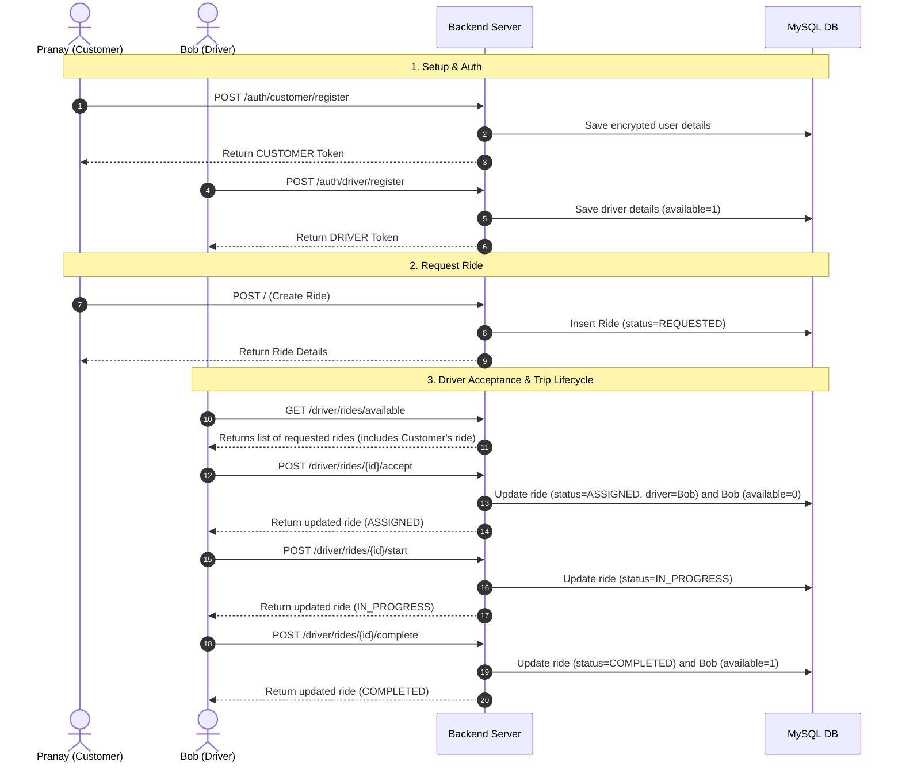

# Ride Booking System Simulator - Postman REST APIs & Testing Guide

This document provides a neat, structured guide to testing and verifying all the API endpoints in the Ride Booking System Simulator using Postman and validating the database state in MySQL.

---

## 1. API Endpoints Table

| #  | Endpoint Description | HTTP Method | URL Path | Auth Required | Body Required |
|:--:| -------------------- |:-----------:| --------------------------------- | ------------- | ------------- |
| 1  | Register Customer    | `POST`      | `/auth/customer/register`         | ❌ No         | ✅ Yes         |
| 2  | Login Customer       | `POST`      | `/auth/customer/login`            | ❌ No         | ✅ Yes         |
| 3  | Register Driver      | `POST`      | `/auth/driver/register`           | ❌ No         | ✅ Yes         |
| 4  | Login Driver         | `POST`      | `/auth/driver/login`              | ❌ No         | ✅ Yes         |
| 5  | Create Ride          | `POST`      | `/`                               | ✅ Customer   | ✅ Yes         |
| 6  | Get Ride Details     | `GET`       | `/{id}`                           | ✅ Customer   | ❌ No          |
| 7  | Cancel Ride          | `DELETE`    | `/{id}`                           | ✅ Customer   | ❌ No          |
| 8  | Get Available Rides  | `GET`       | `/driver/rides/available`         | ✅ Driver     | ❌ No          |
| 9  | Accept Ride          | `POST`      | `/driver/rides/{rideId}/accept`   | ✅ Driver     | ❌ No          |
| 10 | Start Ride           | `POST`      | `/driver/rides/{rideId}/start`    | ✅ Driver     | ❌ No          |
| 11 | Complete Ride        | `POST`      | `/driver/rides/{rideId}/complete` | ✅ Driver     | ❌ No          |

---

## 2. Setting Up Postman Variables (Highly Recommended)

To avoid manual copy-pasting of JWT tokens between requests, set up a Postman **Environment** with these variables:
*   `customer_token`: Bearer token for authorized customer requests.
*   `driver_token`: Bearer token for authorized driver requests.
*   `rideId`: The ID of the ride created for testing (e.g., `1`, `2`, `5`).

> [!TIP]
> **Automating Token Capture in Postman**
> In Postman, click on the **Tests** tab of the **Register Customer** and **Login Customer** requests, and add the following script:
> ```javascript
> const response = pm.response.json();
> if (response.token) {
>     pm.environment.set("customer_token", response.token);
>     console.log("Customer Token automatically set!");
> }
> ```
> Add the same script to **Register Driver** and **Login Driver**, but change `"customer_token"` to `"driver_token"`. Postman will now capture and update your tokens automatically!

---

## 3. Detailed Endpoint Reference

### 🔐 Authentication Flow (Public)

#### 1. Register Customer
*   **Method**: `POST`
*   **URL**: `http://localhost:8080/auth/customer/register`
*   **Headers**: `Content-Type: application/json`
*   **Body (JSON)**:
    ```json
    {
      "name": "Pranay",
      "email": "pranay@test.com",
      "password": "password123",
      "phoneNumber": "1234567890"
    }
    ```
*   **Verification**:
    *   **Status**: `200 OK`
    *   **Response Body**: Check that the JSON response contains a `token` (JWT) and `"role": "CUSTOMER"`.
    *   **Database Verification**: Execute `SELECT * FROM customers WHERE email = 'pranay@test.com';` in MySQL to confirm the customer record is inserted with the password hashed using BCrypt.

#### 2. Login Customer
*   **Method**: `POST`
*   **URL**: `http://localhost:8080/auth/customer/login`
*   **Headers**: `Content-Type: application/json`
*   **Body (JSON)**:
    ```json
    {
      "email": "pranay@test.com",
      "password": "password123"
    }
    ```
*   **Verification**:
    *   **Status**: `200 OK`
    *   **Response Body**: Confirm a new JWT token is returned.

#### 3. Register Driver
*   **Method**: `POST`
*   **URL**: `http://localhost:8080/auth/driver/register`
*   **Headers**: `Content-Type: application/json`
*   **Body (JSON)**:
    ```json
    {
      "name": "Bob",
      "email": "bob@test.com",
      "password": "password123",
      "phoneNumber": "9876543210",
      "vehicleNumber": "TS-09-XYZ",
      "available": true
    }
    ```
*   **Verification**:
    *   **Status**: `200 OK`
    *   **Response Body**: Check that the JSON response contains a `token` (JWT) and `"role": "DRIVER"`.
    *   **Database Verification**: `SELECT * FROM drivers WHERE email = 'bob@test.com';` shows the record with `available = 1` (true).

#### 4. Login Driver
*   **Method**: `POST`
*   **URL**: `http://localhost:8080/auth/driver/login`
*   **Headers**: `Content-Type: application/json`
*   **Body (JSON)**:
    ```json
    {
      "email": "bob@test.com",
      "password": "password123"
    }
    ```
*   **Verification**:
    *   **Status**: `200 OK`
    *   **Response Body**: Validate that a driver JWT is returned.

---

### 🚗 Customer Ride Operations (Requires Customer JWT Token)

> [!IMPORTANT]
> For all requests in this section, go to the **Authorization** tab in Postman, select **Bearer Token** from the Type dropdown, and set the value to `{{customer_token}}`.

#### 5. Create Ride
*   **Method**: `POST`
*   **URL**: `http://localhost:8080/`
*   **Headers**:
    *   `Content-Type: application/json`
*   **Body (JSON)**:
    ```json
    {
      "pickupLocation": "Ameerpet",
      "dropLocation": "Hitech City",
      "fare": 250.0
    }
    ```
*   **Verification**:
    *   **Status**: `200 OK`
    *   **Response Body**: Verify `"status": "REQUESTED"`, `"customerName": "Pranay"`, and `"driverName": null`.
    *   *Postman Tip*: Capture the returned `id` (e.g., `5`) and save it to the `rideId` variable.

#### 6. Get Ride Details
*   **Method**: `GET`
*   **URL**: `http://localhost:8080/{{rideId}}`
*   **Verification**:
    *   **Status**: `200 OK`
    *   *Rule Check*: A customer can only get details of their own rides. Attempting to access another customer's ride will return a `404 Not Found`.

#### 7. Cancel Ride
*   **Method**: `DELETE`
*   **URL**: `http://localhost:8080/{{rideId}}`
*   **Verification**:
    *   **Status**: `200 OK` (No content returned in the body).
    *   Execute `GET /{{rideId}}` again. The status should now be `"CANCELLED"`.
    *   *Note*: Completed rides cannot be cancelled (returns `409 Conflict`).

---

### 🏁 Driver Workflow Operations (Requires Driver JWT Token)

> [!IMPORTANT]
> For all requests in this section, go to the **Authorization** tab in Postman, select **Bearer Token** from the Type dropdown, and set the value to `{{driver_token}}`.

#### 8. Get Available Rides
*   **Method**: `GET`
*   **URL**: `http://localhost:8080/driver/rides/available`
*   **Verification**:
    *   **Status**: `200 OK`
    *   **Response Body**: Returns a JSON list of available rides (status `REQUESTED` and no driver assigned).

#### 9. Accept Ride
*   **Method**: `POST`
*   **URL**: `http://localhost:8080/driver/rides/{{rideId}}/accept`
*   **Verification**:
    *   **Status**: `200 OK`
    *   **Response Body**: The ride transitions to `"status": "ASSIGNED"` and `"driverName": "Bob"`.
    *   **Database Verification**: Run `SELECT available FROM drivers WHERE name = 'Bob';` to confirm it returns `0` (false). The driver is marked busy.

#### 10. Start Ride
*   **Method**: `POST`
*   **URL**: `http://localhost:8080/driver/rides/{{rideId}}/start`
*   **Verification**:
    *   **Status**: `200 OK`
    *   **Response Body**: Verify `"status": "IN_PROGRESS"`.
    *   *Rule Check*: Only the assigned driver can start the ride.

#### 11. Complete Ride
*   **Method**: `POST`
*   **URL**: `http://localhost:8080/driver/rides/{{rideId}}/complete`
*   **Verification**:
    *   **Status**: `200 OK`
    *   **Response Body**: Verify `"status": "COMPLETED"`.
    *   **Database Verification**: `SELECT available FROM drivers WHERE name = 'Bob';` returns `1` (true). The driver is now available again.

---

## 4. End-to-End Testing Demo Order

To showcase the simulator to an interviewer or verify it completely, follow this exact sequence:


